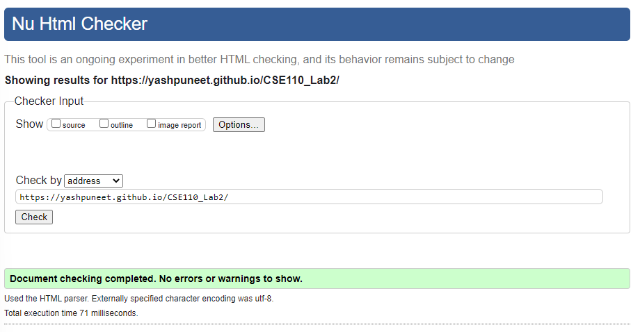

# Lab 3

Link to minutes webpage [https://yashpuneet.github.io/fa22-cse110-lab3/](https://yashpuneet.github.io/fa22-cse110-lab3/).

### W3 Validator Screenshot:

#### Required CSS

- [X] Color
  - [X] rgb color
  - [X] hex color
  - [X] hsl color
  - [X] color name
  - [X] background-color

- [X] Size
  - [X] 3 unique relative units
  - [X] 3 unique absolute units
  - [X] Height
  - [X] Width
  - [X] Max-width
  - [X] Min-width

- [X] Box Model
  - [X] Margins
    - [X] Longhand
    - [X] Shorthand
    - [X] Auto
  - [X] Padding
    - [X] Longhand
    - [X] Shorthand
  - [X] Border
    - [X] Style
    - [X] Color
    - [X] Width
    - [X] Radius
	- [X] Shorthand
    
- [X] Text
  - [X] Color
  - [X] Decoration
  - [X] Align
  - [X] Web font
  
- [X] Display x2
- [X] Position x2

- [X] Psuedo Class
  - [X] hover
  - [X] active

- [X] Screen Width Media Query

- [X] Layouts: more than 2 children and more than 3 flexbox related attributes
  - [X] Flexbox
  - [X] Grid
  
- [ ] Selectors
  - [X] Class
  - [X] ID
  - [X] Universal
  - [X] Element
  - [X] Attribute
  - [X] Pseudoclass
  - [X] List
  - [ ] Combinators
    - [ ] Descendant
    - [ ] Child
    - [ ] General Sibling
    - [ ] Adjacent Sibling
    - [ ] Combining Selectors

